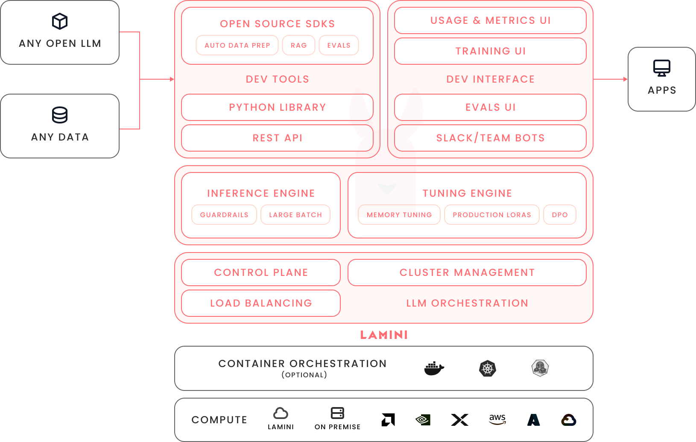

## What is Lamini?

Lamini provides the best LLM inference and tuning for the enterprise. Factual LLMs. Up in 10min. Deployed anywhere.

## Lamini Platform

Lamini Platform orchestrates GPUs to deliver exceptional LLM tuning and inference capabilities, which easily integrate into enterprise applications via the Lamini [Python client](lamini_python_class/lamini.md),[REST API](api.md), and [web UI](inference/playground.md).

See for yourself: take a [quick tour (with free API access!)](quick_start.md) to see how Lamini works, or [contact us](https://www.lamini.ai/contact) to run in your own environment.

## Deployment Models

Lamini Platform is available in [three different deployment models](https://www.lamini.ai/pricing):

- On-Demand: fully-managed training and inference at [https://app.lamini.ai](https://app.lamini.ai), with pay-as-you-go pricing.
- Reserved: dedicated GPUs for your organization, hosted on Lamini's infrastructure, with per-GPU pricing.
- Self-Managed: run Lamini Platform in your environment on your GPUs (on premise, in your VPC, even air-gapped deployments), with per-GPU pricing.

## What's unique about Lamini?

| Area | Problem | Lamini's solution |
|-|-|-|
| Tuning | Hallucinations | [95% accuracy on factual tasks: memory tuning](tuning/memory_tuning.md) |
| Tuning | High infrastructure costs | [32x model compression: Memory Tuning with efficient LoRAs](tuning/memory_tuning.md) |
| Inference | Unreliable app integrations | [100% accurate JSON schema output: structured output](inference/json_output.md)|

## Who are we?

Lamini's team has been finetuning LLMs over the past two decades: we invented core LLM research like LLM scaling laws, shipped LLMs in production to over 1 billion users, taught nearly a quarter million students about [Finetuning LLMs](https://www.deeplearning.ai/short-courses/finetuning-large-language-models/), and mentored the tech leads that went on to build the major foundation models: OpenAI’s GPT-3 and GPT-4, Anthropic’s Claude, Meta’s Llama 3.1, Google’s PaLM, and NVIDIA’s Megatron.

## What's new?

Check out [our blog](https://www.lamini.ai/blog) for the latest updates.

  
