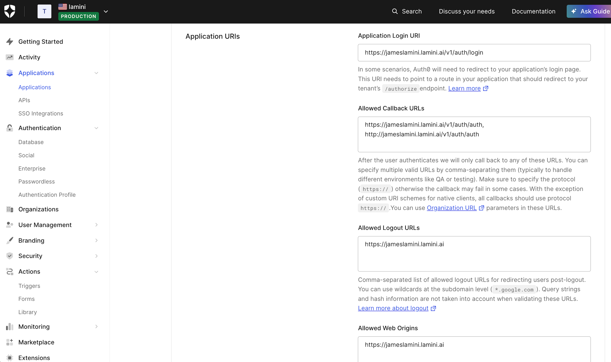
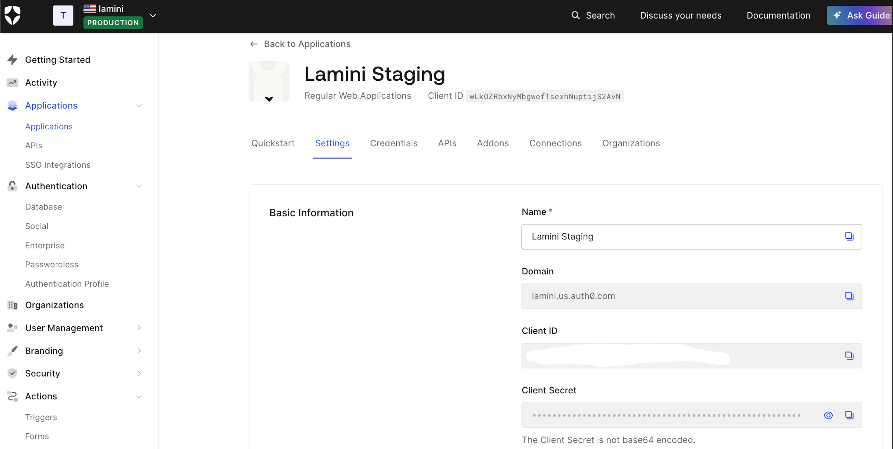

# Auth Setup

## Prerequisites

This example uses [auth0.com](https://auth0.com) as the authentication provider.

## Step 1: Configure Authentication

Configure Auth0 as shown:



Obtain the necessary Auth0 information:



set auth.disable_auth to False in llama_config_edits.yaml:

```bash
auth:
    disable_auth: False
```

Add the following credentials from your application setup on Auth0 in llama_config_edits.yaml:

```bash
auth_provider:
    client_id: <client_id>
    client_secret: <client_secret>
    server_metadata_url: <server_metadata_url>
```

Run the ./generate_helm_charts.sh script to regenerate the lamini folder.

## Step 2: Add a New User and Token

After installation, sign up a new user. We recommend using a group email such as engineer@example.com so that access isn't tied to a specific employee's account.

Replace the test_token in llama_config_edits.yaml with the API key of engineer@example.com:

```bash
auth:
    test_token: <api_key>
```

Delete the existing lamini folder, then run ./generate_helm_charts.sh again to regenerate it.

## Step 3: Set the Admin Token

Update the admin_token in lamini/values.yaml with the corresponding API key:

```bash
security:
  admin_token: <api_key>
```

## Step 4: Disable the Test Token (Optional)

You can disable the test token in the database with the following SQL command:

```sql
update tokens set deleted = true where token='test_token';
```
