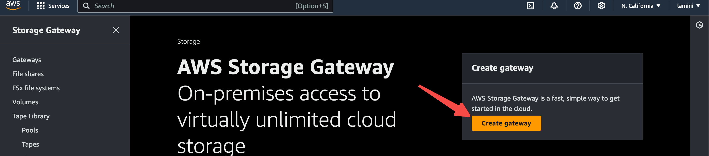
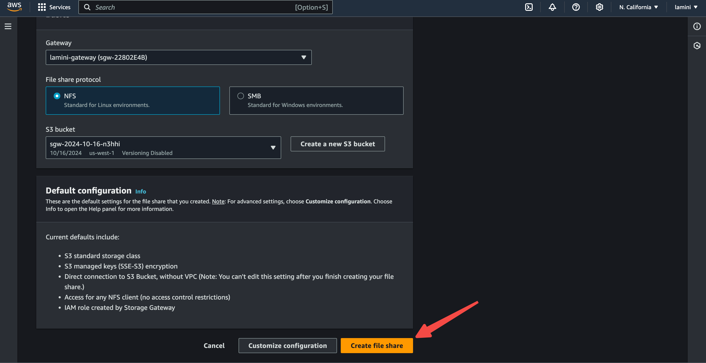
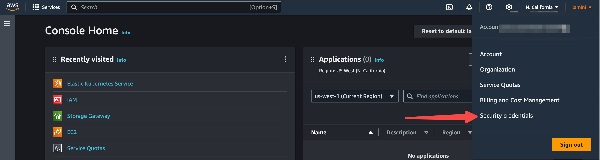
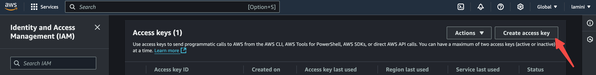
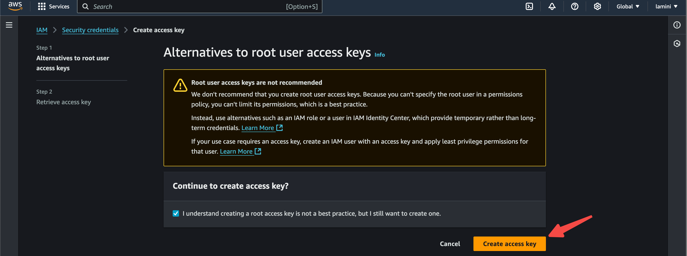

_# AWS EKS Installation

## Create EKS Cluster

1. Type EKS in the AWS search bar of the AWS landing page. Select the EKS.


2. Click Add Cluster and then Create, to create a cluster.


3. Enter a cluster name.


4. Create an IAM role for EKS.


5. Select the EKS service and check the EKS - Cluster


6. Enter the role name.


7. Select networking and specify the default security groups.


8. Create the EKS cluster.


9. It will show the creating status.


## Set Up NFS

1. Create AWS S3 File Gateway. Type Storage Gateway in the search bar of AWS Console.


2. Click on Create gateway.



3. Enter gateway name and timezone.


4. Select EC2 as platform option and create the instance key pair.


5. Enter the key pair name and create the key pair. Download the pem file to be used for accessing the instance for deployment later.


6. Launch the instance.


7. Connect to AWS - select the IP address connection option and publicly accessible endpoint option.


8. Activate gateway.


9. Configure after activating the gateway.


10. Create file share.


11. Select the gateway that just created, set NFS protocol, and then create the S3 bucket.


12. Select the S3 that was just created.


13. Create the file share.



14. Note down the NFS IP and path that will be used in the NFS setup for Lamini installation.


## Create Node Group

1. Select the EKS cluster that was just created.


2. Select the Compute.


3. Select Add Node Group.


4. Create an instance role with policy.


5. Select EC2.


6. Ensure to select the following policies:
AmazonEC2ContainerRegistryReadOnly
AmazonEKSWorkerNodePolicy
AmazonEKS_CNI_Policy


7. Enter a role name and create the role.


8. Enter the node group name and the role that was created.


9. Set Amazon Linux 2 CPU Enabled AMI type, select the desired instance type with GPU, typically the G and P type. Set disk size to at least 100 G.


10. Specify the desired node size.


11. Create the node group.


12. Once the node group has been created, note down the node names that will be used in the lamini installer configuration.


### Install AWS CLI

1. Follow the AWS instruction to install the AWS CLI
https://docs.aws.amazon.com/cli/latest/userguide/getting-started-install.html

2. Check the AWS CLI installation.

```bash
aws --version
```

### Access EKS Cluster

1. Create and get the AWS Access Key ID and AWS Secret Access Key.








2. Configure AWS credential.

```bash
aws configure
```


```bash
aws eks update-kubeconfig --name <eks-cluster-name>
```


### Install Lamini Installer

Follow the Installing Lamini Platform on Kubernetes section in [Kube installer README.md](https://github.com/lamini-ai/lamini-platform/blob/main/deployments/kube-installer/README.md) to complete the Lamini installation on EKS.
