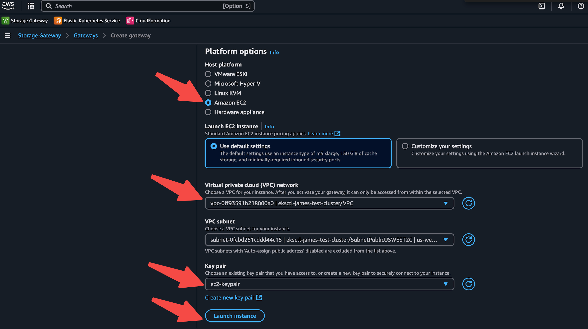
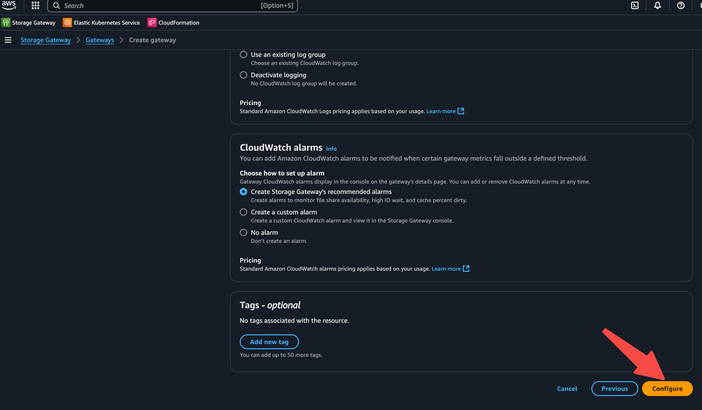
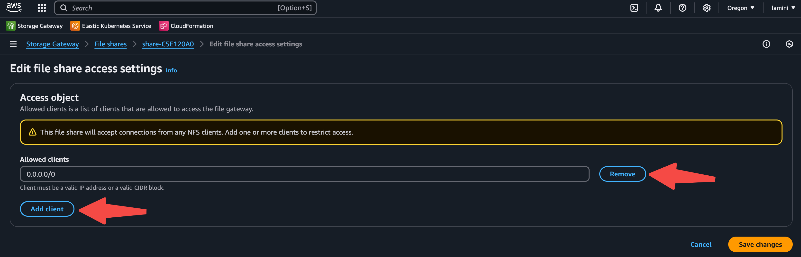
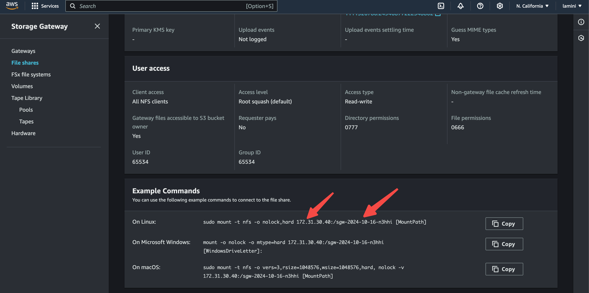

# AWS EKS Setup

!!! note
    The Lamini installer is only available when self-managing Lamini Platform. [Contact us](https://www.lamini.ai/contact) to learn more.

## Summary

This installation covers the steps of setting up an AWS EKS cluster,
and creating a S3-backed NFS storage gateway for installing Lamini Platform.

- Prerequisites
- Install AWS CLI
- Configure AWS credential
- Create Key Pair
- Create EKS Cluster
- Set Up NFS
- Install Lamini Installer

## Prerequisites

An AWS account with GPU instances available, such as the [G type](https://aws.amazon.com/ec2/instance-types/). We recommend having sufficient resources with 8-GPU instance, such as the g6e.48xlarge.

## Install AWS CLI

Follow the AWS instruction to install the [AWS CLI](
https://docs.aws.amazon.com/cli/latest/userguide/getting-started-install.html)
Check the AWS CLI installation.

```shell
aws --version
```

## Configure AWS credential

Create and get the AWS Access Key ID and AWS Secret Access Key.


Configure AWS credential.

```bash
aws configure
```


```bash
aws eks update-kubeconfig --name <eks-cluster-name>
```


## Create Key Pair

Create Key Pair with AWS CLI, this is used to get SSH access to the nodes in the EKS cluster.

```shell
aws ec2 create-key-pair --key-name my-eks-keypair --query 'KeyMaterial' --output text > my-eks-keypair.pem
chmod 400 my-eks-keypair.pem
```

## Create EKS Cluster

Use `eksctl` to manage EKS clusters. Eksctl is a "battery-included" tool, which manages
many dependent aspects of EKS cluster. For example, it automatically install GPU plugins when
requesting GPU instances, which is not the case when manually create with EKS web UI or `aws` CLI.

To install eksctl on mac:

```shell
brew install eksctl
```

To Create a new EKS cluster:

```shell
eksctl create cluster \
  --name=<name> \
  --region=<region> \
  --node-type=<type> \
  --nodes 2 \
  --nodes-min=2 \
  --nodes-max=2 \
  --managed \
  --ssh-access \
  --ssh-public-key=my-eks-keypair
```

To add a new node group to an existing EKS cluster:

```shell
eksctl create nodegroup \
  --cluster=<cluster-name> \
  --name=<node-type>-group \
  --region=<region> \
  --nodes=1 \
  --nodes-min=1 \
  --nodes-max=1 \
  --node-type=<node-type> \
  --managed \
  --ssh-access \
  --ssh-public-key=my-eks-keypair
```

To remove a node group from an existing EKS cluster:

```shell
eksctl delete nodegroup \
  --cluster=<cluster-name> \
  --name=<node-group-name> \
  --region=<region>
```

To get access to a EKS cluster:

```shell
REGION=<your-region>
eksctl get cluster --region=${REGION}
# This will write kube config for the cluster
eksctl utils write-kubeconfig --cluster=yaxiong-test-3 --region=${REGION}
kubectl get node
```

## Set Up NFS

Create AWS S3 File Gateway. Type Storage Gateway in the search bar of AWS Console.


Click on Create gateway.


Enter gateway name and timezone.


Launch EC2 instance as the gateway instance, choose the following options:
Platform options: Amazon EC2;
VPC network: Select the VPC of the created EKS cluster;
Key pair: Select the created instance key pair;
then click **Launch the instance**.


Connect to AWS - select the IP address connection option and publicly accessible endpoint option.


Activate gateway.


Configure after activating the gateway.


Create file share.


Select the gateway that just created, set NFS protocol, and then create the S3 bucket.


Select the S3 that was just created.


Create the file share.


Add the file share client access restriction as needed.




Note down the NFS IP and path that will be used in the NFS setup for Lamini installation.
They are used as NFS_IP in NFS_SUBFOLDER_PATH for installing NFS provisioner when
installing Lamini Platform.



## Install Lamini Platform with installer

Follow the [Kubernetes installation guide](kubernetes_install.md)
to install Lamini Platform with the installer.

## AWS instance types recommendation

We recommend the following AWS instance types for running the Lamini Platform:
- G6 series: Sufficient for running models with fewer than 10B parameters.
- P4 series: Recommended as a general-purpose option.

For specific use cases or requirements, please reach out to us.

