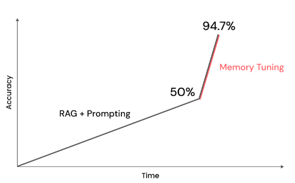

# Tuning Quick Start
When running inference, with prompt-engineering and RAG, is not enough for your LLM, you can tune it. This is harder but will result in better performance, better leverage of your data, and increased knowledge and reasoning capabilities.

There are many ways to tune your LLM. We'll cover two methods here. A traditional tuning method, and memory tuning with our custom formula for photographic memory:

- Basic tuning: build your own LLM for specific domain knowledge or task with finetuning, domain adaptation, and more
- Memory tuning: build your own LLM for specific domain knowledge or task with memory tuning, eliminating hallucinations

## Basic tuning

=== "Python SDK"

    First, get data and put it into an `input` and `output` format. We recommend at least 20-40 examples.

    Sample data:

    ```python
    {
        "input": "Are there any step-by-step tutorials or walkthroughs available in the documentation?",
        "output": "Yes, there are step-by-step tutorials and walkthroughs available in the documentation section. Here\u2019s an example for using Lamini to get insights into any python SDK: https://lamini-ai.github.io/example/",
    }
    ```

    <details>
    <summary>Code for <code>get_data()</code></summary>

    ```py
    # code/quick_start.py#L1-L44
    ```

    </details>

    Next, instantiate and tune the model!
    ```py
    # code/quick_start.py#L47-L51
    ```
=== "REST API"
    See the [REST API docs](../rest_api/train.md) for more details on tuning, checking the status of the tuning job, canceling the job, evaluating the model, loading data, and deleting data.

You can track the tuning progress and view eval results at [https://app.lamini.ai/train](https://app.lamini.ai/train).

## Memory Tuning
Lamini Memory Tuning is a new way to embed facts into LLMs that improves factual accuracy to previously-unachievable levels. Learn how in the [Memory Tuning section](./memory_tuning.md) or check out our blog post: [http://www.lamini.ai/blog/lamini-memory-tuning](http://www.lamini.ai/blog/lamini-memory-tuning).



## Known issue: Tuning on a previously tuned model
Submitting a tuning job on a model is not supported.

### Workaround
To include additional data, submit a new tuning job with the new data on the base model instead of adding the data to a previously tuned model. If your use case requires more than 500 data points, [reach out to us for support](https://www.lamini.ai/contact).

### Future support
We are evaluating the feasibility of supporting continued tuning on previously tuned models. If we decide to support this feature, we will update our documentation and notify users.

Feel free to [contact us](https://www.lamini.ai/contact) with any questions or concerns.
